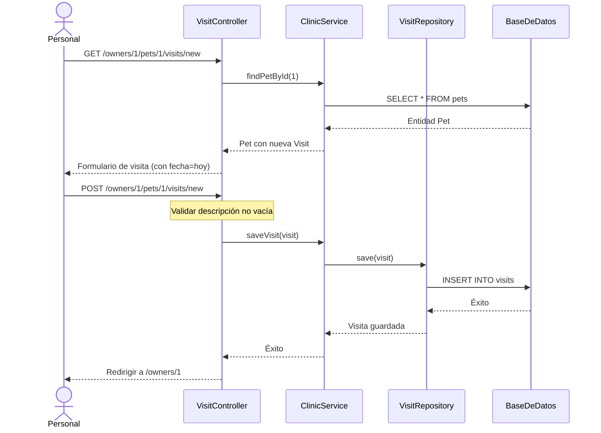

# Documento de Requisitos Funcionales

## Spring Framework PetClinic

| Información del Documento | |
|---------------------------|---|
| **Versión** | 1.0 |
| **Fecha** | 2026-02-13 |
| **Estado** | Final |
| **Proyecto** | Spring Framework PetClinic |

---

## Tabla de Contenidos

1. [Introducción](#1-introducción)
2. [Visión General del Sistema](#2-visión-general-del-sistema)
3. [Actores](#3-actores)
4. [Requisitos Funcionales](#4-requisitos-funcionales)
5. [Casos de Uso](#5-casos-de-uso)
6. [Reglas de Negocio](#6-reglas-de-negocio)
7. [Requisitos de Datos](#7-requisitos-de-datos)
8. [Historias de Usuario](#8-historias-de-usuario)
9. [Requisitos No Funcionales](#9-requisitos-no-funcionales)
10. [Diagramas de Flujo de Datos](#10-diagramas-de-flujo-de-datos)

---

## 1. Introducción

### 1.1 Propósito

Este documento especifica los requisitos funcionales para la aplicación Spring Framework PetClinic, un sistema de gestión de clínica veterinaria. Describe **qué hace el sistema** desde una perspectiva de negocio y usuario, sirviendo como referencia para desarrollo, pruebas y comunicación con stakeholders.

### 1.2 Alcance

La aplicación PetClinic proporciona funcionalidad para:
- Gestionar propietarios de mascotas y su información de contacto
- Registrar y gestionar mascotas
- Programar y hacer seguimiento de visitas veterinarias
- Ver directorio de veterinarios y especialidades

### 1.3 Definiciones

| Término | Definición |
|---------|------------|
| **Propietario (Owner)** | Una persona que posee una o más mascotas y es cliente de la clínica |
| **Mascota (Pet)** | Un animal registrado en el sistema, perteneciente a un propietario |
| **Visita (Visit)** | Una cita programada o completada para una mascota en la clínica |
| **Veterinario (Vet)** | Un veterinario que trabaja en la clínica |
| **Especialidad (Specialty)** | Una especialización médica que puede tener un veterinario |
| **Tipo de Mascota (Pet Type)** | Categoría de mascota (gato, perro, pájaro, etc.) |

### 1.4 Contexto del Sistema

```
┌─────────────────────────────────────────────────────────────┐
│                     SISTEMA PETCLINIC                        │
│  ┌─────────────┐  ┌─────────────┐  ┌─────────────────────┐ │
│  │  Gestión de │  │ Gestión de  │  │   Programación      │ │
│  │ Propietarios│  │  Mascotas   │  │   de Visitas        │ │
│  └─────────────┘  └─────────────┘  └─────────────────────┘ │
│  ┌─────────────────────────────────────────────────────────┐│
│  │              Directorio de Veterinarios                 ││
│  └─────────────────────────────────────────────────────────┘│
└─────────────────────────────────────────────────────────────┘
                              │
        ┌─────────────────────┼─────────────────────┐
        ▼                     ▼                     ▼
┌─────────────┐       ┌─────────────┐       ┌─────────────┐
│ Personal de │       │  Admin del  │       │ Integraciones│
│ la Clínica  │       │   Sistema   │       │   Externas   │
└─────────────┘       └─────────────┘       └─────────────┘
```

---

## 2. Visión General del Sistema

### 2.1 Contexto de Negocio

La aplicación PetClinic sirve como sistema operacional para una clínica veterinaria, permitiendo al personal:
- Mantener una base de datos de propietarios de mascotas y sus mascotas
- Hacer seguimiento del historial de salud de las mascotas a través de registros de visitas
- Acceder a información de veterinarios y especialidades

### 2.2 Resumen de Características del Sistema

| Característica | Descripción | Prioridad |
|----------------|-------------|-----------|
| Gestión de Propietarios | Crear, ver, editar, buscar propietarios | Alta |
| Gestión de Mascotas | Registrar mascotas, asignar a propietarios, seguimiento de tipos | Alta |
| Gestión de Visitas | Programar visitas, registrar descripciones | Alta |
| Directorio de Veterinarios | Ver veterinarios y sus especialidades | Media |
| Exportación Multi-formato | Exportar datos de veterinarios como JSON/XML | Baja |

---

## 3. Actores

### 3.1 Actores Principales

| Actor | Descripción | Nivel de Acceso |
|-------|-------------|-----------------|
| **Personal de Clínica** | Personal de recepción que gestiona registros de propietarios/mascotas y programa visitas | Operaciones CRUD completas |
| **Veterinario** | Ve información de pacientes (mascotas) e historial de visitas | Acceso de lectura |
| **Gerente de Clínica** | Supervisa operaciones y ve informes | Acceso completo |

### 3.2 Actores Secundarios

| Actor | Descripción |
|-------|-------------|
| **Base de Datos** | Persiste todos los datos de propietarios, mascotas, visitas y veterinarios |
| **Sistema Externo** | Consume datos de veterinarios en JSON/XML via API |

---

## 4. Requisitos Funcionales

### 4.1 Gestión de Propietarios

#### RF-001: Crear Propietario
| Atributo | Valor |
|----------|-------|
| **ID** | RF-001 |
| **Nombre** | Crear Propietario |
| **Prioridad** | Alta |
| **Descripción** | El sistema permitirá a los usuarios crear nuevos registros de propietarios con información personal y de contacto |
| **Justificación** | Los propietarios deben estar registrados antes de poder añadir sus mascotas al sistema |
| **Criterios de Aceptación** | |
| | ✅ El usuario puede acceder al formulario de creación de propietario |
| | ✅ El formulario valida campos requeridos antes del envío |
| | ✅ El nuevo propietario se persiste en la base de datos |
| | ✅ El usuario es redirigido a los detalles del propietario tras la creación |
| **Dependencias** | Ninguna |

#### RF-002: Buscar Propietarios
| Atributo | Valor |
|----------|-------|
| **ID** | RF-002 |
| **Nombre** | Buscar Propietarios |
| **Prioridad** | Alta |
| **Descripción** | El sistema permitirá a los usuarios buscar propietarios por apellido |
| **Justificación** | El personal necesita localizar rápidamente registros de propietarios |
| **Criterios de Aceptación** | |
| | ✅ El formulario de búsqueda acepta entrada de apellido |
| | ✅ Se soporta coincidencia parcial (búsqueda por prefijo) |
| | ✅ Búsqueda vacía devuelve todos los propietarios |
| | ✅ Resultado único redirige a detalles del propietario |
| | ✅ Múltiples resultados muestran lista de selección |
| | ✅ Sin resultados muestra mensaje apropiado |
| **Dependencias** | RF-001 |

#### RF-003: Ver Detalles de Propietario
| Atributo | Valor |
|----------|-------|
| **ID** | RF-003 |
| **Nombre** | Ver Detalles de Propietario |
| **Prioridad** | Alta |
| **Descripción** | El sistema mostrará información completa del propietario incluyendo mascotas asociadas y su historial de visitas |
| **Justificación** | El personal necesita vista completa de datos de propietario y mascota |
| **Criterios de Aceptación** | |
| | ✅ Información personal del propietario mostrada |
| | ✅ Lista de mascotas con nombres y fechas de nacimiento |
| | ✅ Historial de visitas para cada mascota mostrado |
| | ✅ Acciones disponibles: Editar Propietario, Añadir Mascota, Añadir Visita |
| **Dependencias** | RF-001 |

#### RF-004: Editar Propietario
| Atributo | Valor |
|----------|-------|
| **ID** | RF-004 |
| **Nombre** | Editar Propietario |
| **Prioridad** | Alta |
| **Descripción** | El sistema permitirá modificación de registros de propietarios existentes |
| **Justificación** | La información de contacto puede cambiar con el tiempo |
| **Criterios de Aceptación** | |
| | ✅ Formulario de edición pre-poblado con datos actuales |
| | ✅ Campo ID no es editable |
| | ✅ Validación aplicada en actualización |
| | ✅ Cambios persistidos en base de datos |
| | ✅ Redirección a detalles del propietario tras guardar |
| **Dependencias** | RF-001, RF-003 |

---

### 4.2 Gestión de Mascotas

#### RF-005: Registrar Mascota
| Atributo | Valor |
|----------|-------|
| **ID** | RF-005 |
| **Nombre** | Registrar Mascota |
| **Prioridad** | Alta |
| **Descripción** | El sistema permitirá el registro de nuevas mascotas para propietarios existentes |
| **Justificación** | Las mascotas deben estar registradas para hacer seguimiento de sus registros de salud |
| **Criterios de Aceptación** | |
| | ✅ Formulario de creación de mascota accesible desde detalles del propietario |
| | ✅ Tipos de mascota disponibles para selección |
| | ✅ Campos requeridos: nombre, tipo, fecha de nacimiento |
| | ✅ Mascota automáticamente asociada con propietario |
| | ✅ Validación de nombre de mascota duplicado (por propietario) |
| **Dependencias** | RF-001, RF-003 |

#### RF-006: Editar Mascota
| Atributo | Valor |
|----------|-------|
| **ID** | RF-006 |
| **Nombre** | Editar Mascota |
| **Prioridad** | Media |
| **Descripción** | El sistema permitirá modificación de información de mascota |
| **Justificación** | Los detalles de mascota pueden necesitar corrección o actualización |
| **Criterios de Aceptación** | |
| | ✅ Formulario de edición pre-poblado con datos actuales de mascota |
| | ✅ Tipo de mascota modificable |
| | ✅ Asociación con propietario mantenida |
| | ✅ Validación aplicada en actualización |
| **Dependencias** | RF-005 |

#### RF-007: Listar Tipos de Mascota
| Atributo | Valor |
|----------|-------|
| **ID** | RF-007 |
| **Nombre** | Listar Tipos de Mascota |
| **Prioridad** | Media |
| **Descripción** | El sistema proporcionará una lista de tipos de mascota disponibles para selección |
| **Justificación** | Categorías estandarizadas de mascotas aseguran consistencia de datos |
| **Criterios de Aceptación** | |
| | ✅ Tipos de mascota cargados desde base de datos |
| | ✅ Tipos mostrados en selección desplegable |
| | ✅ Tipos soportados: gato, perro, lagarto, serpiente, pájaro, hámster |
| **Dependencias** | Ninguna |

---

### 4.3 Gestión de Visitas

#### RF-008: Programar Visita
| Atributo | Valor |
|----------|-------|
| **ID** | RF-008 |
| **Nombre** | Programar Visita |
| **Prioridad** | Alta |
| **Descripción** | El sistema permitirá programar nuevas visitas para mascotas registradas |
| **Justificación** | El seguimiento de visitas es fundamental para las operaciones de la clínica veterinaria |
| **Criterios de Aceptación** | |
| | ✅ Formulario de visita accesible desde detalles del propietario |
| | ✅ Fecha por defecto es la fecha actual |
| | ✅ Campo descripción requerido |
| | ✅ Visita asociada con mascota específica |
| | ✅ Nueva visita aparece en historial de visitas de la mascota |
| **Dependencias** | RF-005 |

#### RF-009: Ver Historial de Visitas
| Atributo | Valor |
|----------|-------|
| **ID** | RF-009 |
| **Nombre** | Ver Historial de Visitas |
| **Prioridad** | Alta |
| **Descripción** | El sistema mostrará historial cronológico de visitas para cada mascota |
| **Justificación** | Los datos históricos de salud son esenciales para el cuidado veterinario |
| **Criterios de Aceptación** | |
| | ✅ Visitas mostradas en orden cronológico inverso (más recientes primero) |
| | ✅ Cada visita muestra fecha y descripción |
| | ✅ Accesible desde página de detalles del propietario |
| **Dependencias** | RF-008 |

---

### 4.4 Directorio de Veterinarios

#### RF-010: Ver Lista de Veterinarios
| Atributo | Valor |
|----------|-------|
| **ID** | RF-010 |
| **Nombre** | Ver Lista de Veterinarios |
| **Prioridad** | Media |
| **Descripción** | El sistema mostrará un directorio de todos los veterinarios con sus especialidades |
| **Justificación** | El personal y los clientes necesitan conocer los veterinarios disponibles |
| **Criterios de Aceptación** | |
| | ✅ Todos los veterinarios listados con nombres |
| | ✅ Especialidades mostradas para cada veterinario |
| | ✅ Veterinarios sin especialidades muestran "ninguna" |
| | ✅ Datos cacheados para rendimiento |
| **Dependencias** | Ninguna |

#### RF-011: Exportar Datos de Veterinarios
| Atributo | Valor |
|----------|-------|
| **ID** | RF-011 |
| **Nombre** | Exportar Datos de Veterinarios |
| **Prioridad** | Baja |
| **Descripción** | El sistema proporcionará datos de veterinarios en formatos JSON y XML |
| **Justificación** | Habilitar integración con sistemas externos |
| **Criterios de Aceptación** | |
| | ✅ Exportación JSON en `/vets.json` |
| | ✅ Exportación XML en `/vets.xml` |
| | ✅ Respuesta incluye lista de veterinarios con especialidades |
| | ✅ Cabeceras content-type apropiadas |
| **Dependencias** | RF-010 |

---

## 5. Casos de Uso

### CU-001: Registrar Nuevo Propietario

| Atributo | Descripción |
|----------|-------------|
| **ID** | CU-001 |
| **Nombre** | Registrar Nuevo Propietario |
| **Actor** | Personal de Clínica |
| **Descripción** | Registrar un nuevo propietario de mascota en el sistema |
| **Precondiciones** | El personal tiene acceso al sistema |
| **Disparador** | Nuevo cliente llega a la clínica |

**Flujo Principal:**
```
1. El personal navega a la página "Buscar Propietarios"
2. El personal hace clic en el botón "Añadir Propietario"
3. El sistema muestra formulario de registro de propietario
4. El personal introduce detalles del propietario:
   - Nombre
   - Apellido
   - Dirección
   - Ciudad
   - Teléfono
5. El personal envía el formulario
6. El sistema valida los datos de entrada
7. El sistema crea el registro del propietario
8. El sistema redirige a la página de detalle del nuevo propietario
```

**Flujos Alternativos:**

| ID | Condición | Flujo |
|----|-----------|-------|
| FA-1 | Validación falla | Sistema muestra mensajes de error, usuario corrige entrada, re-envía |
| FA-2 | Acción cancelar | Usuario navega fuera, no se crea registro |

**Postcondiciones:**
- Nuevo registro de propietario existe en la base de datos
- Página de detalle del propietario muestra nueva información

**Reglas de Negocio:** RN-001, RN-002, RN-003

---

### CU-002: Buscar Propietario

| Atributo | Descripción |
|----------|-------------|
| **ID** | CU-002 |
| **Nombre** | Buscar Propietario |
| **Actor** | Personal de Clínica |
| **Descripción** | Encontrar propietario existente por apellido |
| **Precondiciones** | Al menos un propietario existe en el sistema |
| **Disparador** | Cliente llama o visita la clínica |

**Flujo Principal:**
```
1. El personal navega a la página "Buscar Propietarios"
2. El personal introduce apellido (parcial o completo)
3. El personal hace clic en el botón "Buscar Propietario"
4. El sistema busca propietarios coincidentes
5. El sistema muestra resultados:
   - Coincidencia única: Redirigir a detalles del propietario
   - Múltiples coincidencias: Mostrar lista de selección
   - Sin coincidencias: Mostrar mensaje "no encontrado"
```

**Flujos Alternativos:**

| ID | Condición | Flujo |
|----|-----------|-------|
| FA-1 | Búsqueda vacía | Sistema devuelve todos los propietarios |
| FA-2 | Múltiples resultados | Personal selecciona de la lista para ver detalles |

**Postcondiciones:**
- Propietario(s) coincidente(s) mostrados o mensaje apropiado mostrado

**Reglas de Negocio:** RN-004

---

### CU-003: Registrar Nueva Mascota

| Atributo | Descripción |
|----------|-------------|
| **ID** | CU-003 |
| **Nombre** | Registrar Nueva Mascota |
| **Actor** | Personal de Clínica |
| **Descripción** | Añadir nueva mascota al registro de un propietario existente |
| **Precondiciones** | El propietario existe en el sistema |
| **Disparador** | El propietario trae nueva mascota a la clínica |

**Flujo Principal:**
```
1. El personal navega a la página de detalle del propietario
2. El personal hace clic en el botón "Añadir Nueva Mascota"
3. El sistema muestra formulario de registro de mascota con tipos de mascota
4. El personal introduce detalles de la mascota:
   - Nombre
   - Fecha de Nacimiento
   - Tipo (desde desplegable)
5. El personal envía el formulario
6. El sistema valida los datos de entrada
7. El sistema valida unicidad del nombre de mascota para el propietario
8. El sistema crea registro de mascota vinculado al propietario
9. El sistema redirige a la página de detalle del propietario
```

**Flujos Alternativos:**

| ID | Condición | Flujo |
|----|-----------|-------|
| FA-1 | Nombre de mascota duplicado | Sistema muestra error "ya existe" |
| FA-2 | Campo requerido faltante | Sistema muestra errores de validación |

**Postcondiciones:**
- Nuevo registro de mascota existe vinculado al propietario
- La mascota aparece en la lista de mascotas del propietario

**Reglas de Negocio:** RN-005, RN-006, RN-007, RN-008

---

### CU-004: Programar Visita Veterinaria

| Atributo | Descripción |
|----------|-------------|
| **ID** | CU-004 |
| **Nombre** | Programar Visita Veterinaria |
| **Actor** | Personal de Clínica |
| **Descripción** | Crear nuevo registro de visita para una mascota |
| **Precondiciones** | Mascota y propietario existen en el sistema |
| **Disparador** | La mascota viene para revisión o tratamiento |

**Flujo Principal:**
```
1. El personal navega a la página de detalle del propietario
2. El personal localiza la mascota en la lista de mascotas
3. El personal hace clic en "Añadir Visita" para la mascota
4. El sistema muestra formulario de visita con fecha actual
5. El personal introduce descripción de la visita
6. El personal envía el formulario
7. El sistema valida que la descripción no está vacía
8. El sistema crea registro de visita vinculado a la mascota
9. El sistema redirige a la página de detalle del propietario
```

**Flujos Alternativos:**

| ID | Condición | Flujo |
|----|-----------|-------|
| FA-1 | Descripción vacía | Sistema muestra error "requerido" |
| FA-2 | Se necesita fecha diferente | Personal modifica fecha antes del envío |

**Postcondiciones:**
- Nuevo registro de visita existe vinculado a la mascota
- La visita aparece en el historial de visitas de la mascota

**Reglas de Negocio:** RN-009

---

### CU-005: Ver Directorio de Veterinarios

| Atributo | Descripción |
|----------|-------------|
| **ID** | CU-005 |
| **Nombre** | Ver Directorio de Veterinarios |
| **Actor** | Personal de Clínica / Cliente |
| **Descripción** | Ver lista de veterinarios y especialidades |
| **Precondiciones** | Datos de veterinarios existen |
| **Disparador** | Solicitud de información sobre veterinarios disponibles |

**Flujo Principal:**
```
1. El usuario navega a la página "Veterinarios"
2. El sistema recupera datos de veterinarios (desde caché si está disponible)
3. El sistema muestra lista de veterinarios con:
   - Nombre completo
   - Especialidades (o "ninguna")
4. El usuario revisa la información
```

**Flujos Alternativos:**

| ID | Condición | Flujo |
|----|-----------|-------|
| FA-1 | Se necesita formato JSON | Usuario accede a /vets.json |
| FA-2 | Se necesita formato XML | Usuario accede a /vets.xml |

**Postcondiciones:**
- Información de veterinarios mostrada al usuario

**Reglas de Negocio:** RN-010

---

### CU-006: Editar Información de Propietario

| Atributo | Descripción |
|----------|-------------|
| **ID** | CU-006 |
| **Nombre** | Editar Información de Propietario |
| **Actor** | Personal de Clínica |
| **Descripción** | Actualizar detalles de contacto de propietario existente |
| **Precondiciones** | El propietario existe en el sistema |
| **Disparador** | El cliente reporta cambio de dirección o teléfono |

**Flujo Principal:**
```
1. El personal navega a la página de detalle del propietario
2. El personal hace clic en el botón "Editar Propietario"
3. El sistema muestra formulario de edición con datos actuales
4. El personal modifica campos según sea necesario
5. El personal envía el formulario
6. El sistema valida la entrada
7. El sistema actualiza el registro del propietario
8. El sistema redirige a la página de detalle del propietario
```

**Postcondiciones:**
- Registro del propietario actualizado con nueva información

**Reglas de Negocio:** RN-001, RN-002, RN-003

---

### CU-007: Editar Información de Mascota

| Atributo | Descripción |
|----------|-------------|
| **ID** | CU-007 |
| **Nombre** | Editar Información de Mascota |
| **Actor** | Personal de Clínica |
| **Descripción** | Actualizar detalles de mascota existente |
| **Precondiciones** | La mascota existe en el sistema |
| **Disparador** | Se necesita corrección o cambio de tipo |

**Flujo Principal:**
```
1. El personal navega a la página de detalle del propietario
2. El personal hace clic en "Editar Mascota" para mascota específica
3. El sistema muestra formulario de edición con datos actuales
4. El personal modifica campos según sea necesario
5. El personal envía el formulario
6. El sistema valida la entrada
7. El sistema actualiza el registro de la mascota
8. El sistema redirige a la página de detalle del propietario
```

**Postcondiciones:**
- Registro de mascota actualizado con nueva información

**Reglas de Negocio:** RN-005, RN-006, RN-007

---

## 6. Reglas de Negocio

### Reglas Relacionadas con Propietario

#### RN-001: Nombre de Propietario Requerido
| Atributo | Valor |
|----------|-------|
| **ID** | RN-001 |
| **Nombre** | Nombre de Propietario Requerido |
| **Descripción** | El nombre del propietario no debe estar vacío |
| **Implementación** | Validación `@NotEmpty` en `Person.firstName` |
| **Excepción** | Envío de formulario rechazado con error "requerido" |

#### RN-002: Apellido de Propietario Requerido
| Atributo | Valor |
|----------|-------|
| **ID** | RN-002 |
| **Nombre** | Apellido de Propietario Requerido |
| **Descripción** | El apellido del propietario no debe estar vacío |
| **Implementación** | Validación `@NotEmpty` en `Person.lastName` |
| **Excepción** | Envío de formulario rechazado con error "requerido" |

#### RN-003: Información de Contacto de Propietario Requerida
| Atributo | Valor |
|----------|-------|
| **ID** | RN-003 |
| **Nombre** | Información de Contacto de Propietario Requerida |
| **Descripción** | La dirección, ciudad y teléfono del propietario no deben estar vacíos |
| **Implementación** | Validación `@NotEmpty` en campos de `Owner` |
| **Excepción** | Envío de formulario rechazado con error "requerido" |

#### RN-004: Búsqueda de Propietario por Prefijo de Apellido
| Atributo | Valor |
|----------|-------|
| **ID** | RN-004 |
| **Nombre** | Búsqueda de Propietario por Prefijo de Apellido |
| **Descripción** | La búsqueda de propietarios coincide con apellidos que empiezan con el término de búsqueda |
| **Implementación** | SQL `LIKE` con patrón de sufijo `%` |
| **Excepción** | Ninguna - búsqueda vacía devuelve todos los propietarios |

---

### Reglas Relacionadas con Mascota

#### RN-005: Nombre de Mascota Requerido
| Atributo | Valor |
|----------|-------|
| **ID** | RN-005 |
| **Nombre** | Nombre de Mascota Requerido |
| **Descripción** | El nombre de la mascota no debe estar vacío |
| **Implementación** | `PetValidator.validate()` verifica `StringUtils.hasLength(name)` |
| **Excepción** | Envío de formulario rechazado con error "requerido" |

#### RN-006: Tipo de Mascota Requerido para Nuevas Mascotas
| Atributo | Valor |
|----------|-------|
| **ID** | RN-006 |
| **Nombre** | Tipo de Mascota Requerido para Nuevas Mascotas |
| **Descripción** | Las nuevas mascotas deben tener un tipo asignado |
| **Implementación** | `PetValidator.validate()` verifica `pet.isNew() && pet.getType() == null` |
| **Excepción** | Envío de formulario rechazado con error "requerido" |

#### RN-007: Fecha de Nacimiento de Mascota Requerida
| Atributo | Valor |
|----------|-------|
| **ID** | RN-007 |
| **Nombre** | Fecha de Nacimiento de Mascota Requerida |
| **Descripción** | Se debe proporcionar la fecha de nacimiento de la mascota |
| **Implementación** | `PetValidator.validate()` verifica `pet.getBirthDate() == null` |
| **Excepción** | Envío de formulario rechazado con error "requerido" |

#### RN-008: Nombre de Mascota Único por Propietario
| Atributo | Valor |
|----------|-------|
| **ID** | RN-008 |
| **Nombre** | Nombre de Mascota Único por Propietario |
| **Descripción** | Un propietario no puede tener dos mascotas con el mismo nombre |
| **Implementación** | `PetController.processCreationForm()` verifica `owner.getPet(name, true) != null` |
| **Excepción** | Envío de formulario rechazado con error "ya existe" |

---

### Reglas Relacionadas con Visita

#### RN-009: Descripción de Visita Requerida
| Atributo | Valor |
|----------|-------|
| **ID** | RN-009 |
| **Nombre** | Descripción de Visita Requerida |
| **Descripción** | La visita debe tener una descripción |
| **Implementación** | Validación `@NotEmpty` en `Visit.description` |
| **Excepción** | Envío de formulario rechazado con error de validación |

---

### Reglas Relacionadas con Veterinario

#### RN-010: Caché de Datos de Veterinarios
| Atributo | Valor |
|----------|-------|
| **ID** | RN-010 |
| **Nombre** | Caché de Datos de Veterinarios |
| **Descripción** | Los datos de veterinarios se cachean para rendimiento |
| **Implementación** | `@Cacheable(value = "vets")` en `ClinicServiceImpl.findVets()` |
| **Excepción** | Ninguna - fallo de caché dispara consulta a base de datos |

---

## 7. Requisitos de Datos

### 7.1 Entidad: Propietario (Owner)

| Campo | Tipo | Requerido | Restricciones | Descripción |
|-------|------|-----------|---------------|-------------|
| `id` | Integer | Auto | Clave Primaria | Identificador único |
| `firstName` | String | Sí | No Vacío | Nombre del propietario |
| `lastName` | String | Sí | No Vacío | Apellido del propietario |
| `address` | String | Sí | No Vacío | Dirección |
| `city` | String | Sí | No Vacío | Ciudad de residencia |
| `telephone` | String | Sí | No Vacío, Digits(10) | Número de teléfono |
| `pets` | Set\<Pet\> | No | Uno-a-Muchos | Mascotas asociadas |

### 7.2 Entidad: Mascota (Pet)

| Campo | Tipo | Requerido | Restricciones | Descripción |
|-------|------|-----------|---------------|-------------|
| `id` | Integer | Auto | Clave Primaria | Identificador único |
| `name` | String | Sí | No Vacío | Nombre de la mascota |
| `birthDate` | LocalDate | Sí | Formato: yyyy/MM/dd | Fecha de nacimiento |
| `type` | PetType | Sí | Clave Foránea | Categoría de mascota |
| `owner` | Owner | Sí | Clave Foránea | Persona propietaria |
| `visits` | Set\<Visit\> | No | Uno-a-Muchos | Historial de visitas |

### 7.3 Entidad: Visita (Visit)

| Campo | Tipo | Requerido | Restricciones | Descripción |
|-------|------|-----------|---------------|-------------|
| `id` | Integer | Auto | Clave Primaria | Identificador único |
| `date` | LocalDate | No | Por defecto: hoy | Fecha de visita |
| `description` | String | Sí | No Vacío | Notas de la visita |
| `pet` | Pet | Sí | Clave Foránea | Mascota asociada |

### 7.4 Entidad: Veterinario (Vet)

| Campo | Tipo | Requerido | Restricciones | Descripción |
|-------|------|-----------|---------------|-------------|
| `id` | Integer | Auto | Clave Primaria | Identificador único |
| `firstName` | String | Sí | No Vacío | Nombre del veterinario |
| `lastName` | String | Sí | No Vacío | Apellido del veterinario |
| `specialties` | Set\<Specialty\> | No | Muchos-a-Muchos | Especializaciones médicas |

### 7.5 Entidad: TipoMascota (PetType)

| Campo | Tipo | Requerido | Restricciones | Descripción |
|-------|------|-----------|---------------|-------------|
| `id` | Integer | Auto | Clave Primaria | Identificador único |
| `name` | String | Sí | No Vacío | Nombre del tipo (gato, perro, etc.) |

### 7.6 Entidad: Especialidad (Specialty)

| Campo | Tipo | Requerido | Restricciones | Descripción |
|-------|------|-----------|---------------|-------------|
| `id` | Integer | Auto | Clave Primaria | Identificador único |
| `name` | String | Sí | No Vacío | Nombre de la especialidad |

### 7.7 Datos de Referencia

**Tipos de Mascota:**
| ID | Nombre |
|----|--------|
| 1 | gato |
| 2 | perro |
| 3 | lagarto |
| 4 | serpiente |
| 5 | pájaro |
| 6 | hámster |

**Especialidades:**
| ID | Nombre |
|----|--------|
| 1 | radiología |
| 2 | cirugía |
| 3 | odontología |

---

## 8. Historias de Usuario

### HU-001: Registrar Cliente
```gherkin
Como miembro del personal de la clínica
Quiero registrar un nuevo cliente (propietario) en el sistema
Para poder hacer seguimiento de sus mascotas y visitas

Criterios de Aceptación:
Dado que estoy en la página "Añadir Propietario"
Cuando introduzco información válida del propietario (nombre, apellido, dirección, ciudad, teléfono)
Y hago clic en "Añadir Propietario"
Entonces se crea un nuevo registro de propietario
Y soy redirigido a la página de detalle del propietario
Y veo la información del nuevo propietario mostrada

Escenario: Campo requerido faltante
Dado que estoy en la página "Añadir Propietario"
Cuando dejo el campo "Nombre" vacío
Y hago clic en "Añadir Propietario"
Entonces veo un mensaje de error "requerido"
Y el propietario no se crea
```

**Prioridad:** Alta | **Puntos de Historia:** 3

---

### HU-002: Buscar Cliente
```gherkin
Como miembro del personal de la clínica
Quiero buscar clientes por apellido
Para poder acceder rápidamente a sus registros

Criterios de Aceptación:
Dado que estoy en la página "Buscar Propietarios"
Cuando introduzco "García" en el campo de apellido
Y hago clic en "Buscar Propietario"
Entonces veo una lista de todos los propietarios con apellido que empieza por "García"

Escenario: Resultado único
Dado que solo un propietario coincide con la búsqueda
Cuando busco "Martínez"
Entonces soy redirigido directamente a la página de detalle de Juan Martínez

Escenario: Sin resultados
Dado que ningún propietario coincide con la búsqueda
Cuando busco "Desconocido"
Entonces veo el mensaje "no encontrado"
```

**Prioridad:** Alta | **Puntos de Historia:** 2

---

### HU-003: Registrar Mascota
```gherkin
Como miembro del personal de la clínica
Quiero añadir una nueva mascota al registro de un propietario
Para poder hacer seguimiento del historial de salud de la mascota

Criterios de Aceptación:
Dado que estoy viendo la página de detalle del propietario "Juan García"
Cuando hago clic en "Añadir Nueva Mascota"
E introduzco nombre "Buddy", selecciono tipo "perro", introduzco fecha de nacimiento "2023/05/15"
Y hago clic en "Añadir Mascota"
Entonces la mascota "Buddy" se añade a la lista de mascotas de Juan García
Y soy redirigido a la página de detalle de Juan García

Escenario: Nombre de mascota duplicado
Dado que Juan García ya tiene una mascota llamada "Leo"
Cuando intento añadir otra mascota llamada "Leo"
Entonces veo un mensaje de error "ya existe"
Y la mascota no se crea
```

**Prioridad:** Alta | **Puntos de Historia:** 3

---

### HU-004: Registrar Visita
```gherkin
Como miembro del personal de la clínica
Quiero registrar una visita veterinaria para una mascota
Para poder mantener el historial médico de la mascota

Criterios de Aceptación:
Dado que estoy viendo la página de detalle del propietario
Y veo la mascota "Leo" en la lista de mascotas
Cuando hago clic en "Añadir Visita" para Leo
E introduzco descripción "Revisión anual - todas las vacunas al día"
Y hago clic en "Añadir Visita"
Entonces se registra una nueva visita para Leo
Y veo la visita en el historial de visitas de Leo

Escenario: Descripción vacía
Cuando envío el formulario de visita con descripción vacía
Entonces veo un error de validación
Y la visita no se crea
```

**Prioridad:** Alta | **Puntos de Historia:** 2

---

### HU-005: Ver Veterinarios
```gherkin
Como cliente o miembro del personal
Quiero ver la lista de veterinarios
Para poder ver quién está disponible y sus especialidades

Criterios de Aceptación:
Dado que navego a la página "Veterinarios"
Entonces veo una tabla de todos los veterinarios
Y cada veterinario muestra su nombre y especialidades
Y los veterinarios sin especialidades muestran "ninguna"

Escenario: Exportación JSON
Dado que necesito datos de veterinarios en formato legible por máquina
Cuando accedo a "/vets.json"
Entonces recibo datos JSON con todos los veterinarios
Y el content-type de respuesta es "application/json"
```

**Prioridad:** Media | **Puntos de Historia:** 2

---

### HU-006: Editar Información de Cliente
```gherkin
Como miembro del personal de la clínica
Quiero actualizar la información de contacto de un cliente
Para poder mantener sus registros actualizados

Criterios de Aceptación:
Dado que estoy viendo la página de detalle de "María López"
Cuando hago clic en "Editar Propietario"
Y cambio el teléfono a "6085559999"
Y hago clic en "Actualizar Propietario"
Entonces el teléfono de María López se actualiza a "6085559999"
Y soy redirigido a su página de detalle
```

**Prioridad:** Media | **Puntos de Historia:** 2

---

## 9. Requisitos No Funcionales

### RNF-001: Rendimiento
| Atributo | Valor |
|----------|-------|
| **Descripción** | El sistema responderá a las acciones del usuario en menos de 2 segundos bajo carga normal |
| **Métrica** | Tiempo de respuesta percentil 95 < 2000ms |
| **Implementación** | Caché de datos de veterinarios, pool de conexiones |

### RNF-002: Escalabilidad
| Atributo | Valor |
|----------|-------|
| **Descripción** | El sistema soportará hasta 100 usuarios concurrentes |
| **Métrica** | Sin degradación con 100 sesiones activas |
| **Implementación** | Diseño de controladores sin estado, pool de conexiones de base de datos |

### RNF-003: Integridad de Datos
| Atributo | Valor |
|----------|-------|
| **Descripción** | Todas las operaciones de base de datos serán transaccionales |
| **Métrica** | Cero corrupción de datos bajo operación normal |
| **Implementación** | `@Transactional` en métodos de capa de servicio |

### RNF-004: Compatibilidad
| Atributo | Valor |
|----------|-------|
| **Descripción** | El sistema funcionará con bases de datos H2, HSQLDB, MySQL y PostgreSQL |
| **Métrica** | Todos los tests funcionales pasan en todas las bases de datos |
| **Implementación** | Configuración de base de datos basada en perfiles |

### RNF-005: Mantenibilidad
| Atributo | Valor |
|----------|-------|
| **Descripción** | El sistema seguirá arquitectura en capas para separación de responsabilidades |
| **Métrica** | Calificación de mantenibilidad SonarCloud A |
| **Implementación** | Arquitectura de 3 capas con límites claros entre capas |

---

## 10. Diagramas de Flujo de Datos

### 10.1 Flujo de Registro de Propietario

```
┌──────────┐     ┌──────────────┐     ┌───────────────┐     ┌──────────┐
│ Usuario  │────►│ Controlador  │────►│ ClinicService │────►│ Base de  │
│          │     │ OwnerController│   │ saveOwner()   │     │  Datos   │
└──────────┘     └──────────────┘     └───────────────┘     └──────────┘
     │                   │                    │                   │
     │ 1. Enviar Form    │                    │                   │
     │──────────────────►│                    │                   │
     │                   │ 2. Validar         │                   │
     │                   │────────────────────│                   │
     │                   │ 3. saveOwner(owner)│                   │
     │                   │───────────────────►│                   │
     │                   │                    │ 4. INSERT/UPDATE  │
     │                   │                    │──────────────────►│
     │                   │                    │ 5. Confirmar      │
     │                   │                    │◄──────────────────│
     │                   │ 6. Retornar result.│                   │
     │                   │◄───────────────────│                   │
     │ 7. Redirigir      │                    │                   │
     │◄──────────────────│                    │                   │
```

### 10.2 Diagrama de Secuencia: Añadir Visita



---

## Apéndice A: Matriz de Trazabilidad

| Requisito | Caso de Uso | Regla de Negocio | Historia de Usuario |
|-----------|-------------|------------------|---------------------|
| RF-001 | CU-001 | RN-001, RN-002, RN-003 | HU-001 |
| RF-002 | CU-002 | RN-004 | HU-002 |
| RF-003 | CU-006 | - | HU-006 |
| RF-004 | CU-006 | RN-001, RN-002, RN-003 | HU-006 |
| RF-005 | CU-003 | RN-005, RN-006, RN-007, RN-008 | HU-003 |
| RF-006 | CU-007 | RN-005, RN-006, RN-007 | - |
| RF-007 | CU-003 | - | HU-003 |
| RF-008 | CU-004 | RN-009 | HU-004 |
| RF-009 | CU-004 | - | HU-004 |
| RF-010 | CU-005 | RN-010 | HU-005 |
| RF-011 | CU-005 | - | HU-005 |

---

## Apéndice B: Historial de Revisiones

| Versión | Fecha | Autor | Descripción |
|---------|-------|-------|-------------|
| 1.0 | 2026-02-13 | Agente de Especificación Funcional | Creación inicial del documento |

---

*Generado por el Agente de Especificación Funcional*
