# Spring PetClinic — User Guide

**Version**: 1.0  
**Generated**: 2026-03-05  
**Framework**: Spring MVC 6 + JSP (Server-Side Rendered)

---

## Table of Contents

1. [Getting Started](#1-getting-started)
2. [Application Overview](#2-application-overview)
3. [Use Case Diagrams](#3-use-case-diagrams)
4. [Page Reference](#4-page-reference)
   - 4.1 [Home Page](#41-home-page)
   - 4.2 [Find Owners](#42-find-owners)
   - 4.3 [Owners List](#43-owners-list)
   - 4.4 [Owner Details](#44-owner-details)
   - 4.5 [Add / Edit Owner](#45-add--edit-owner)
   - 4.6 [Add / Edit Pet](#46-add--edit-pet)
   - 4.7 [Add Visit](#47-add-visit)
   - 4.8 [Veterinarians](#48-veterinarians)
   - 4.9 [Error Page](#49-error-page)
5. [User Workflows](#5-user-workflows)
   - 5.1 [Register a New Owner and Pet](#51-workflow-register-a-new-owner-and-pet)
   - 5.2 [Search for an Owner](#52-workflow-search-for-an-owner)
   - 5.3 [Schedule a Veterinary Visit](#53-workflow-schedule-a-veterinary-visit)
   - 5.4 [Update Owner Information](#54-workflow-update-owner-information)
6. [Responsive Design](#6-responsive-design)
7. [Troubleshooting](#7-troubleshooting)

---

## 1. Getting Started

### Accessing the Application

- **URL**: `http://localhost:8080`
- **Supported Browsers**: Chrome, Firefox, Safari, Edge (latest versions)
- **Authentication**: None required — the application is open access

### Starting the Application

Run the following command from the project root directory:

```bash
mvnw.cmd jetty:run-war       # Windows
./mvnw jetty:run-war          # macOS / Linux
```

Wait for the server to start, then open `http://localhost:8080` in your web browser.

### Navigation Overview

The application uses a top navigation bar with four main sections:

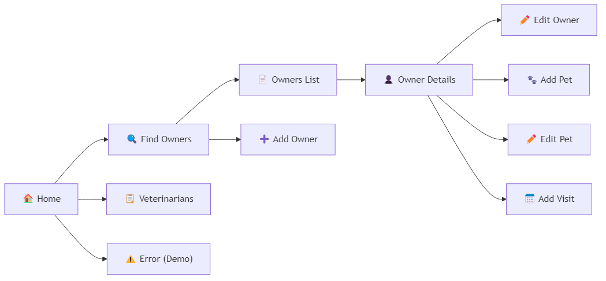

---

## 2. Application Overview

Spring PetClinic is a veterinary clinic management application that allows clinic staff to manage pet owners, their pets, and veterinary visits. The application provides a simple, intuitive interface for:

- **Finding and managing pet owners** — Search by last name, view details, add or edit owner information
- **Managing pets** — Register pets for owners, update pet information including name, birth date, and type
- **Scheduling visits** — Record veterinary visits with dates and descriptions
- **Viewing veterinarians** — Browse the list of veterinarians and their specialties

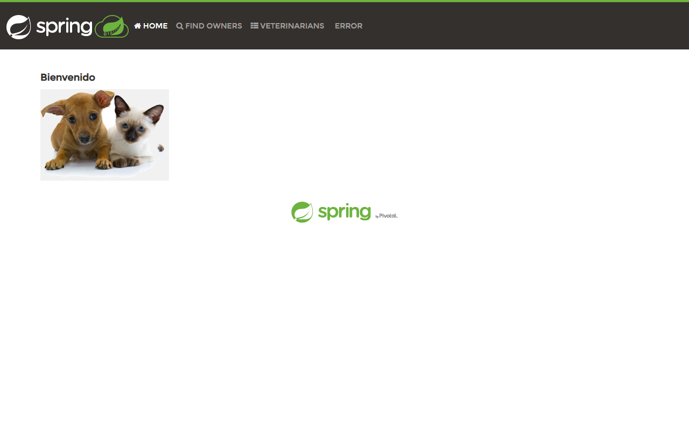

*The home page welcomes users to the PetClinic application.*

---

## 3. Use Case Diagrams

### 3.1 System Overview

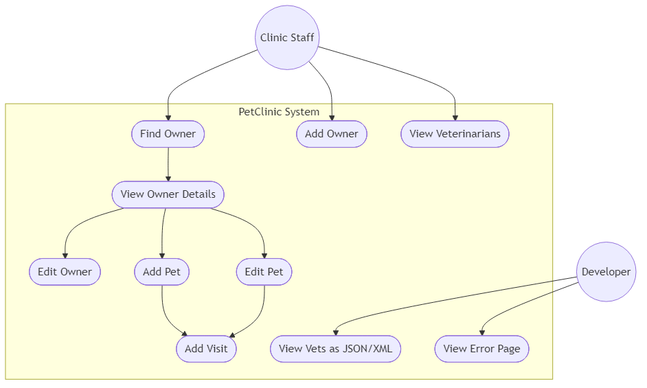

### 3.2 Owner Management Use Cases

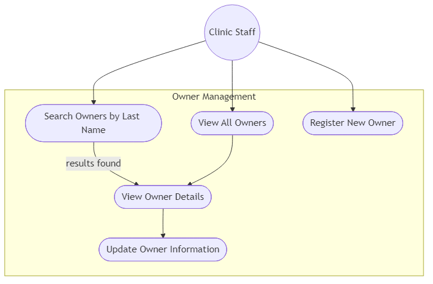

### 3.3 Pet & Visit Management Use Cases

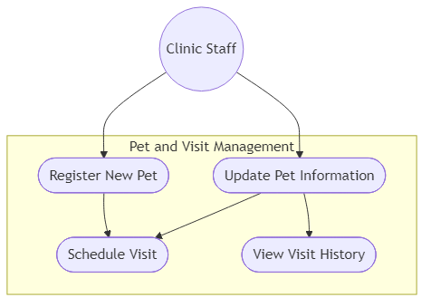

### 3.4 Use Case Reference Table

| Use Case ID | Name | Actor(s) | Description | Related Page |
|-------------|------|----------|-------------|--------------|
| UC-001 | Search Owners | Clinic Staff | Search for owners by last name (partial match) | `/owners/find` |
| UC-002 | View All Owners | Clinic Staff | List all registered owners when search is empty | `/owners` |
| UC-003 | View Owner Details | Clinic Staff | View owner info, pets, and visit history | `/owners/{id}` |
| UC-004 | Register New Owner | Clinic Staff | Add a new pet owner with contact info | `/owners/new` |
| UC-005 | Update Owner Info | Clinic Staff | Edit existing owner's name, address, phone | `/owners/{id}/edit` |
| UC-006 | Register New Pet | Clinic Staff | Add a pet to an existing owner | `/owners/{id}/pets/new` |
| UC-007 | Update Pet Info | Clinic Staff | Edit pet name, birth date, or type | `/owners/{id}/pets/{petId}/edit` |
| UC-008 | Schedule Visit | Clinic Staff | Record a new visit with date and description | `/owners/{id}/pets/{petId}/visits/new` |
| UC-009 | View Veterinarians | Clinic Staff | Browse list of vets and specialties | `/vets` |
| UC-010 | Export Vets (JSON/XML) | Developer | Retrieve vet data in JSON or XML format | `/vets.json`, `/vets.xml` |

---

## 4. Page Reference

### 4.1 Home Page

**URL**: `/`  
**Purpose**: Welcome page and entry point to the application.


The home page displays a welcome message and the PetClinic logo. From here, use the navigation bar to access any section of the application.

#### Available Actions

| Action | Description | Navigation |
|--------|-------------|------------|
| Home | Return to this welcome page | `/` |
| Find owners | Search for pet owners | `/owners/find` |
| Veterinarians | View list of veterinarians | `/vets` |
| Error | Trigger a demo error page | `/oups` |

---

### 4.2 Find Owners

**URL**: `/owners/find`  
**Purpose**: Search for pet owners by last name.

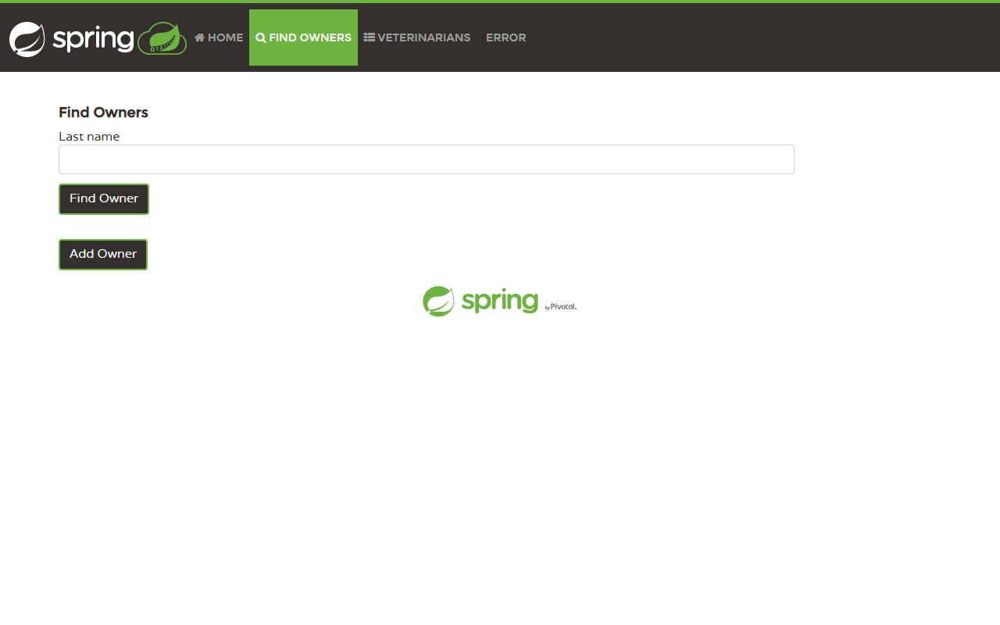

This page provides a search form to locate pet owners. You can search by last name (partial match supported) or submit an empty search to view all owners.

#### Available Actions

| Action | Description | Navigation |
|--------|-------------|------------|
| Find Owner (button) | Submit search with entered last name | `/owners` (results) |
| Add Owner (link) | Register a new pet owner | `/owners/new` |

#### Form Fields

| Field | Type | Required | Validation | Description |
|-------|------|----------|------------|-------------|
| Last name | Text input | No | Max 80 characters | Enter full or partial last name to search |

> **Tip**: Leave the last name field empty and click "Find Owner" to see all registered owners.

---

### 4.3 Owners List

**URL**: `/owners`  
**Purpose**: Display search results of pet owners matching the search criteria.

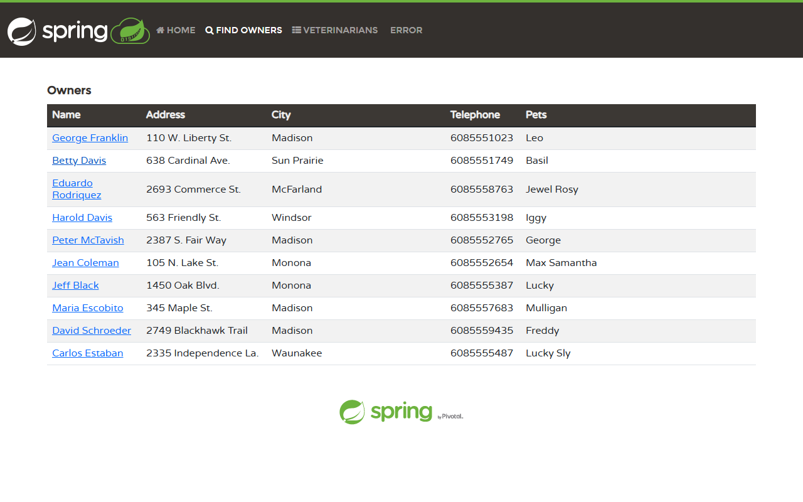

This page displays a table of all owners matching your search criteria. Each row shows the owner's name, address, city, telephone, and their registered pets.

#### Available Actions

| Action | Description | Navigation |
|--------|-------------|------------|
| Click owner name | View detailed information about the owner | `/owners/{id}` |

#### Table Columns

| Column | Description |
|--------|-------------|
| Name | Owner's full name (clickable link to details) |
| Address | Street address |
| City | City of residence |
| Telephone | Contact phone number |
| Pets | Comma-separated list of pet names |

> **Note**: If only one owner matches the search, you will be redirected directly to the owner details page.

---

### 4.4 Owner Details

**URL**: `/owners/{ownerId}`  
**Purpose**: View complete information about an owner, including their pets and visit history.

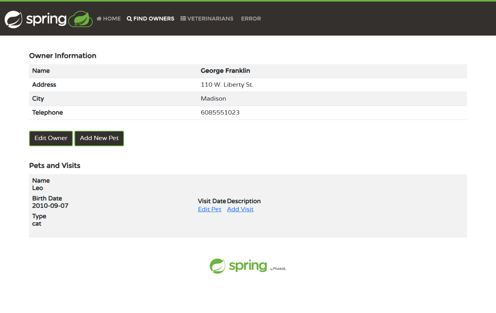

This page shows the owner's personal information, a list of their pets with details, and the visit history for each pet.

#### Available Actions

| Action | Description | Navigation |
|--------|-------------|------------|
| Edit Owner | Modify owner information | `/owners/{id}/edit` |
| Add New Pet | Register a new pet for this owner | `/owners/{id}/pets/new` |
| Edit Pet | Modify pet information | `/owners/{id}/pets/{petId}/edit` |
| Add Visit | Schedule a new visit for a pet | `/owners/{id}/pets/{petId}/visits/new` |

#### Information Displayed

**Owner Information:**

| Field | Description |
|-------|-------------|
| Name | Owner's full name |
| Address | Street address |
| City | City of residence |
| Telephone | Contact phone number |

**Pets and Visits:**

| Field | Description |
|-------|-------------|
| Name | Pet's name |
| Birth Date | Pet's date of birth |
| Type | Species/breed category (e.g., dog, cat, bird) |
| Visit Date | Date of each recorded visit |
| Visit Description | Notes about the visit |

---

### 4.5 Add / Edit Owner

**URL**: `/owners/new` (Add) or `/owners/{ownerId}/edit` (Edit)  
**Purpose**: Register a new pet owner or update existing owner information.

#### Empty Form (Add Owner)
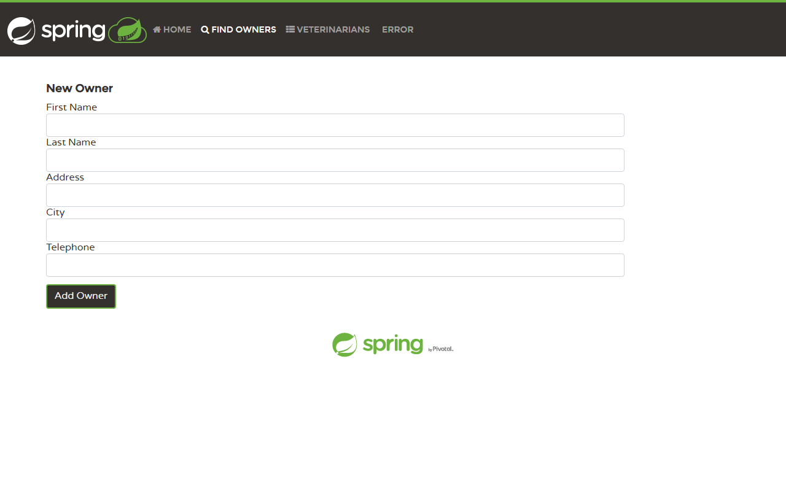

#### Filled Form
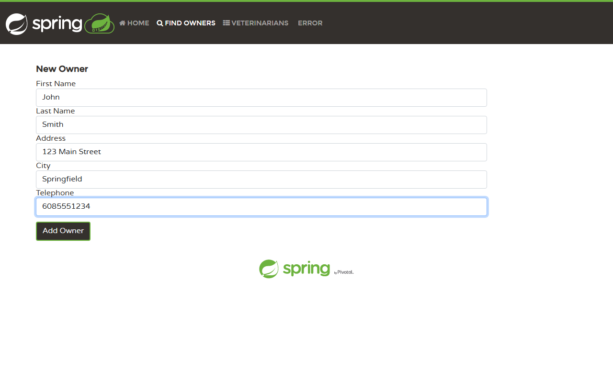

#### Validation Errors
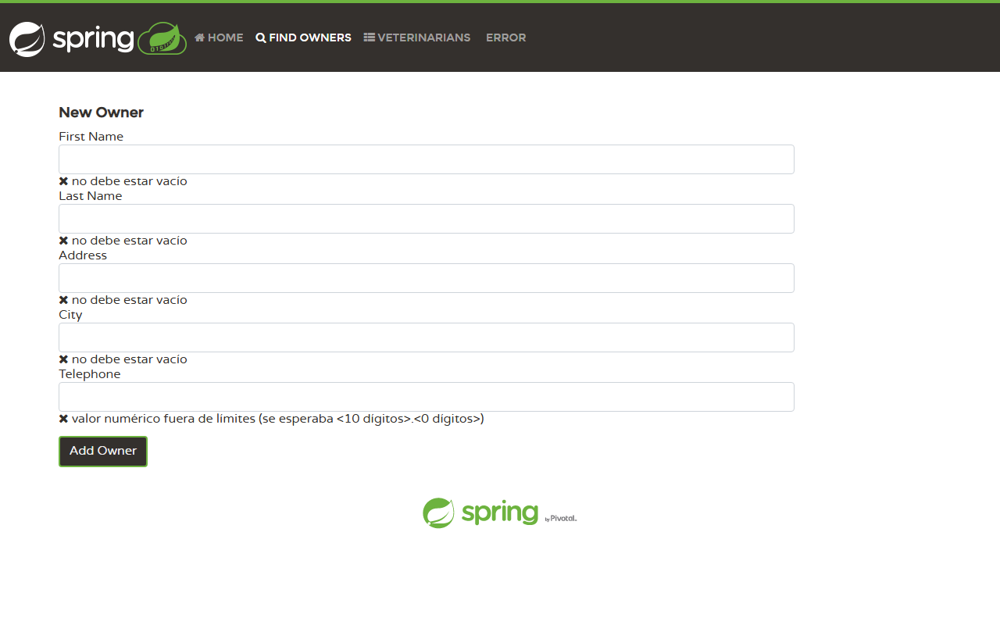

#### Edit Existing Owner
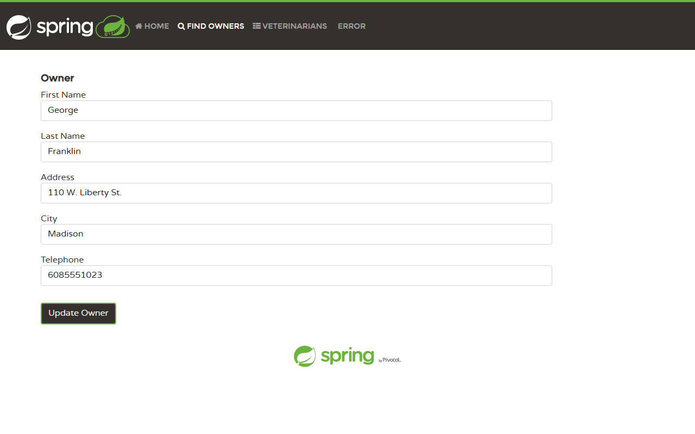

#### Form Fields

| Field | Type | Required | Validation | Description |
|-------|------|----------|------------|-------------|
| First Name | Text input | Yes | Must not be empty | Owner's first name |
| Last Name | Text input | Yes | Must not be empty | Owner's last name |
| Address | Text input | Yes | Must not be empty | Street address |
| City | Text input | Yes | Must not be empty | City of residence |
| Telephone | Text input | Yes | Must be 10 digits, numbers only | Contact phone number |

#### Available Actions

| Action | Description | Navigation |
|--------|-------------|------------|
| Add Owner / Update Owner (button) | Save the form data | Redirects to `/owners/{id}` on success |

> **Validation**: All fields are required. If any field fails validation, the form redisplays with error messages highlighted in red next to the invalid fields.

---

### 4.6 Add / Edit Pet

**URL**: `/owners/{ownerId}/pets/new` (Add) or `/owners/{ownerId}/pets/{petId}/edit` (Edit)  
**Purpose**: Register a new pet or update existing pet information.

#### Empty Form
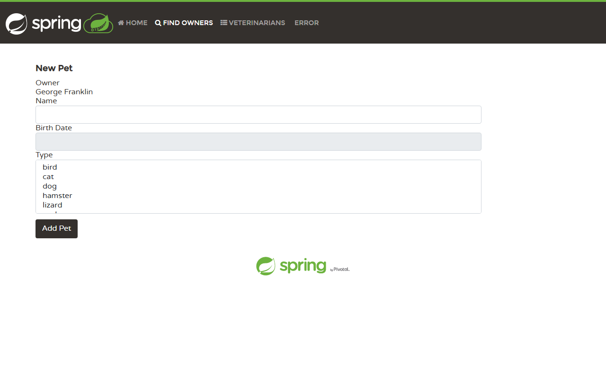

#### Filled Form
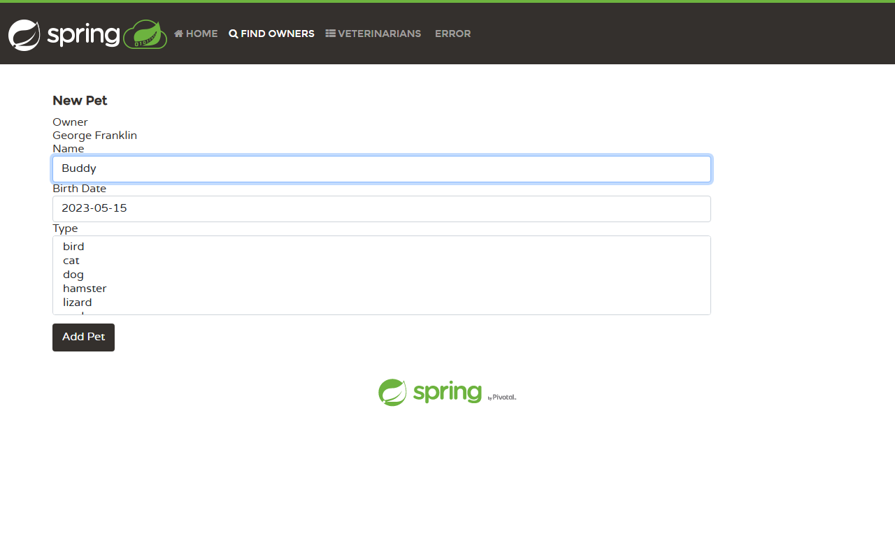

#### Edit Existing Pet
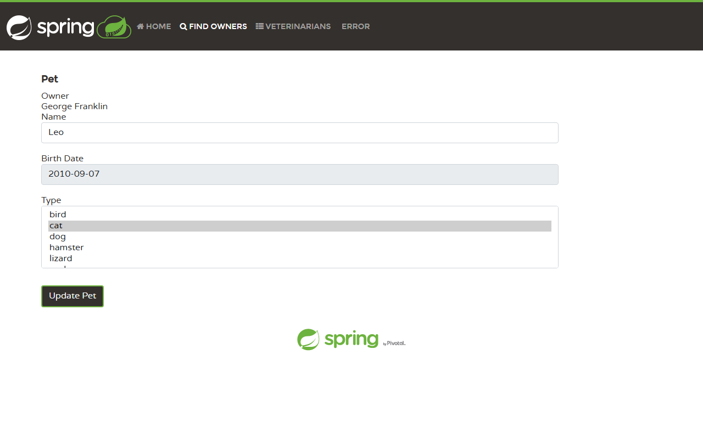

#### Form Fields

| Field | Type | Required | Validation | Description |
|-------|------|----------|------------|-------------|
| Owner | Display (read-only) | — | — | Shows the pet owner's name |
| Name | Text input | Yes | Must not be empty | Pet's name |
| Birth Date | Date picker | Yes | Valid date format | Pet's date of birth (uses Flatpickr calendar widget) |
| Type | Dropdown select | Yes | Must select a type | Pet species: bird, cat, dog, hamster, lizard, snake |

#### Available Actions

| Action | Description | Navigation |
|--------|-------------|------------|
| Add Pet / Update Pet (button) | Save the pet data | Redirects to `/owners/{ownerId}` on success |

> **Tip**: Click the Birth Date field to open a calendar date picker. You can navigate between months and years to select the correct date.

---

### 4.7 Add Visit

**URL**: `/owners/{ownerId}/pets/{petId}/visits/new`  
**Purpose**: Schedule a new veterinary visit for a pet.

#### Empty Form
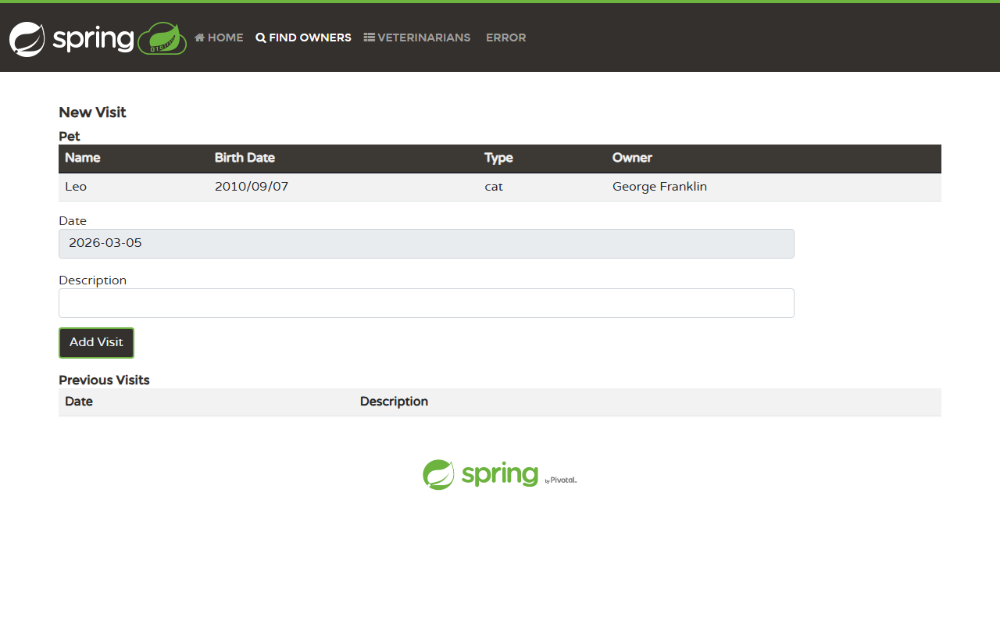

#### Filled Form
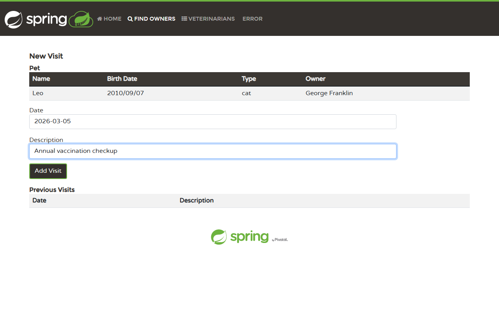

The visit form shows the pet's information at the top (name, birth date, type, and owner) for reference, followed by the new visit form and a history of previous visits.

#### Form Fields

| Field | Type | Required | Validation | Description |
|-------|------|----------|------------|-------------|
| Date | Date picker | Yes | Valid date format | Visit date (uses Flatpickr calendar widget) |
| Description | Text input | Yes | Must not be empty | Brief description of the visit reason |

#### Available Actions

| Action | Description | Navigation |
|--------|-------------|------------|
| Add Visit (button) | Save the visit record | Redirects to `/owners/{ownerId}` on success |

#### Previous Visits Table

| Column | Description |
|--------|-------------|
| Date | The date the visit took place |
| Description | Notes recorded during the visit |

---

### 4.8 Veterinarians

**URL**: `/vets`  
**Purpose**: View the list of all veterinarians at the clinic and their specialties.

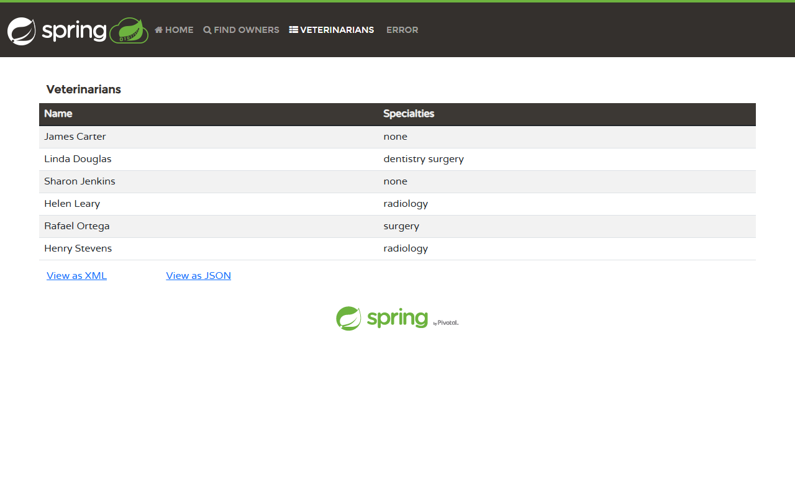

This page displays a table of all veterinarians registered in the system, along with their areas of specialty.

#### Table Columns

| Column | Description |
|--------|-------------|
| Name | Veterinarian's full name |
| Specialties | List of medical specialties (e.g., radiology, surgery, dentistry) |

#### Available Actions

| Action | Description | Navigation |
|--------|-------------|------------|
| View as XML | Download vet data in XML format | `/vets.xml` |
| View as JSON | Download vet data in JSON format | `/vets.json` |

> **Note**: Veterinarians with no listed specialties are general practitioners.

---

### 4.9 Error Page

**URL**: `/oups`  
**Purpose**: Demonstration error page showing how the application handles unexpected errors.

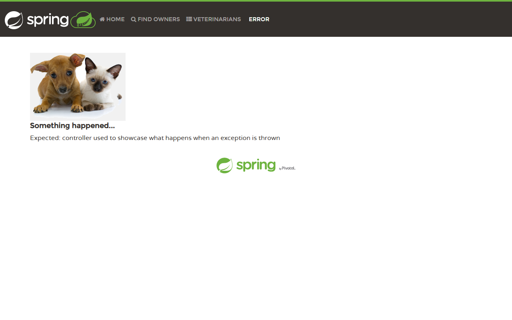

This page is triggered intentionally to demonstrate the application's error handling. In normal use, you should not encounter this page. If you do, it indicates an unexpected server error.

---

## 5. User Workflows

### 5.1 Workflow: Register a New Owner and Pet

**Goal**: Add a new pet owner to the system and register their pet.

---

**Step 1**: Click **"Find owners"** in the navigation bar.


---

**Step 2**: Click the **"Add Owner"** link below the search form.

---

**Step 3**: Fill in the owner information form with all required fields:
- First Name
- Last Name
- Address
- City
- Telephone (10 digits)


---

**Step 4**: Click the **"Add Owner"** button. You will be redirected to the new owner's details page.


---

**Step 5**: On the owner details page, click **"Add New Pet"**.

---

**Step 6**: Fill in the pet information:
- Name
- Birth Date (use the calendar picker)
- Type (select from the dropdown)


---

**Step 7**: Click the **"Add Pet"** button. You will be redirected back to the owner details page, now showing the new pet.

**Result**: The owner and their pet are now registered in the system and visible on the owner details page.

---

### 5.2 Workflow: Search for an Owner

**Goal**: Find an existing pet owner by their last name.

---

**Step 1**: Click **"Find owners"** in the navigation bar.


---

**Step 2**: Type the owner's last name (or part of it) in the **"Last name"** field. For example, type "Davis" to find all owners with that last name.

---

**Step 3**: Click the **"Find Owner"** button.

---

**Step 4a**: If **multiple results** are found, you will see a list of matching owners. Click on the owner's name to view their details.


**Step 4b**: If **one result** is found, you will be redirected directly to the owner details page.

**Step 4c**: If **no results** are found, the search form redisplays with a message indicating no owners were found.

---

**Result**: You are now viewing the owner's complete information, including their pets and visit history.


---

### 5.3 Workflow: Schedule a Veterinary Visit

**Goal**: Record a new veterinary visit for an existing pet.

---

**Step 1**: Find and navigate to the owner's details page (see [Workflow 5.2](#52-workflow-search-for-an-owner)).


---

**Step 2**: In the Pets and Visits section, locate the pet and click the **"Add Visit"** link next to the pet's name.

---

**Step 3**: On the visit form, the pet's information is displayed at the top for reference. Fill in:
- **Date**: Select the visit date using the calendar picker
- **Description**: Enter a brief description (e.g., "Annual vaccination checkup")


---

**Step 4**: Click the **"Add Visit"** button.

---

**Result**: You are redirected to the owner details page. The new visit now appears in the visit history under the corresponding pet.

---

### 5.4 Workflow: Update Owner Information

**Goal**: Edit the contact information for an existing pet owner.

---

**Step 1**: Find and navigate to the owner's details page (see [Workflow 5.2](#52-workflow-search-for-an-owner)).

---

**Step 2**: Click the **"Edit Owner"** link on the owner details page.


---

**Step 3**: Modify the desired fields (e.g., update the address or telephone number).

---

**Step 4**: Click the **"Update Owner"** button.

---

**Result**: The owner information is updated and you are redirected back to the owner details page showing the new information.

---

## 6. Responsive Design

The PetClinic application is built with Bootstrap and supports responsive layouts for mobile and tablet devices. The navigation bar collapses into a hamburger menu on smaller screens.

### Mobile Views

#### Home Page (Mobile)


#### Find Owners (Mobile)
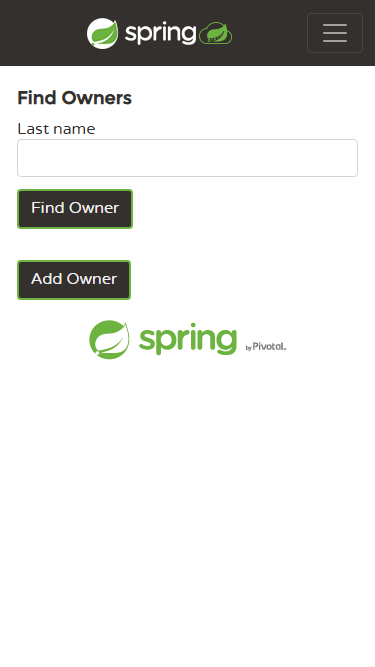

#### Owners List (Mobile)
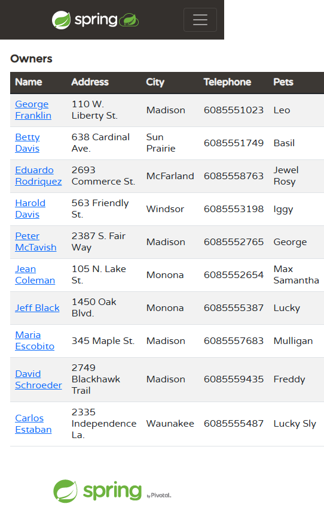

#### Owner Details (Mobile)
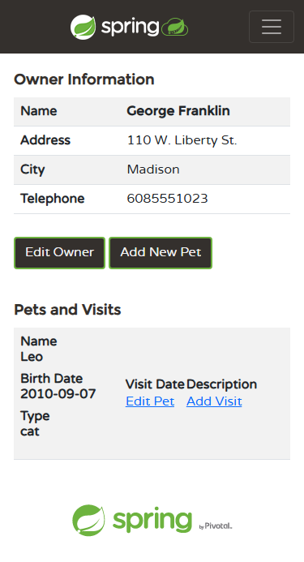

#### Veterinarians (Mobile)
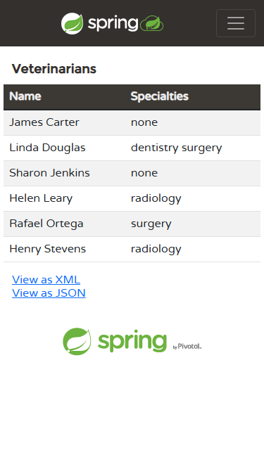

> **Tip**: On mobile devices, tap the hamburger menu icon (☰) at the top right to expand the navigation bar.

---

## 7. Troubleshooting

### Common Issues

| Issue | Cause | Solution |
|-------|-------|----------|
| Application not loading | Jetty server not running | Run `mvnw.cmd jetty:run-war` and wait for startup to complete |
| Page displays "Something happened..." | Unexpected server error occurred | Refresh the page or navigate to Home; check server logs for details |
| Owner form shows validation errors | Required fields are empty or invalid | Ensure all fields are filled; telephone must be exactly 10 digits |
| Date picker not appearing | JavaScript not loaded or blocked | Ensure JavaScript is enabled in your browser; try refreshing the page |
| Search returns no results | No owner matches the last name entered | Try a shorter partial name or leave blank to see all owners |
| Cannot add a pet | Owner does not exist | Register the owner first before adding pets |
| Visit not saved | Required fields are missing | Ensure both Date and Description are filled before submitting |
| Port 8080 already in use | Another application is using the port | Stop the other application or configure PetClinic to use a different port |

### Error Messages

| Error | Meaning | Action |
|-------|---------|--------|
| "must not be empty" | A required form field was left blank | Fill in the highlighted field and resubmit |
| "numeric value out of range" | Telephone number has incorrect format | Enter exactly 10 numeric digits with no spaces or dashes |
| "Something happened..." | Unhandled server exception | Navigate to Home and try the operation again; report to administrator if persistent |
| "404 Not Found" | Requested page does not exist | Check the URL; navigate using the menu bar instead |
| "has been already taken" | Duplicate pet name for the same owner | Choose a different name for the pet |

---

## Appendix: Page URL Quick Reference

| Page | URL | Method |
|------|-----|--------|
| Home | `/` | GET |
| Find Owners | `/owners/find` | GET |
| Owners List / Search | `/owners` | GET |
| Owner Details | `/owners/{id}` | GET |
| Add Owner | `/owners/new` | GET / POST |
| Edit Owner | `/owners/{id}/edit` | GET / POST |
| Add Pet | `/owners/{id}/pets/new` | GET / POST |
| Edit Pet | `/owners/{id}/pets/{petId}/edit` | GET / POST |
| Add Visit | `/owners/{id}/pets/{petId}/visits/new` | GET / POST |
| Veterinarians | `/vets` | GET |
| Vets (JSON) | `/vets.json` | GET |
| Vets (XML) | `/vets.xml` | GET |
| Error Demo | `/oups` | GET |

---

*This guide was auto-generated from the Spring PetClinic source code and live application screenshots.*
